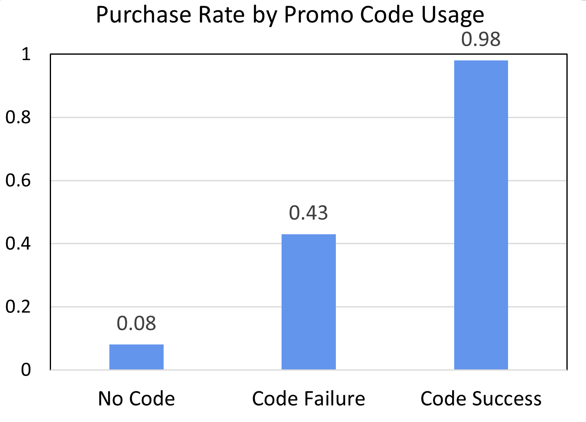
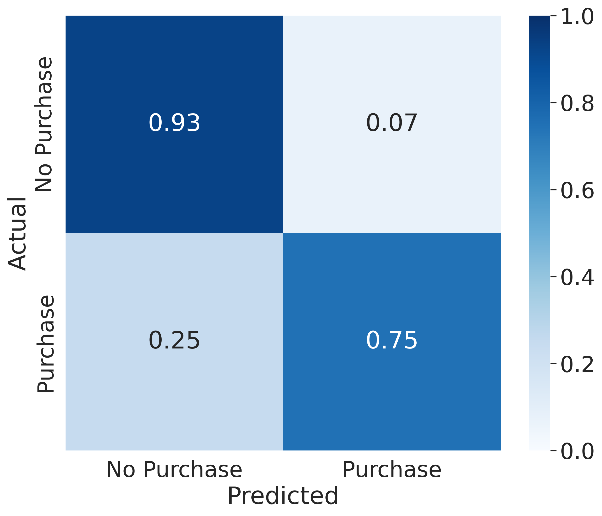
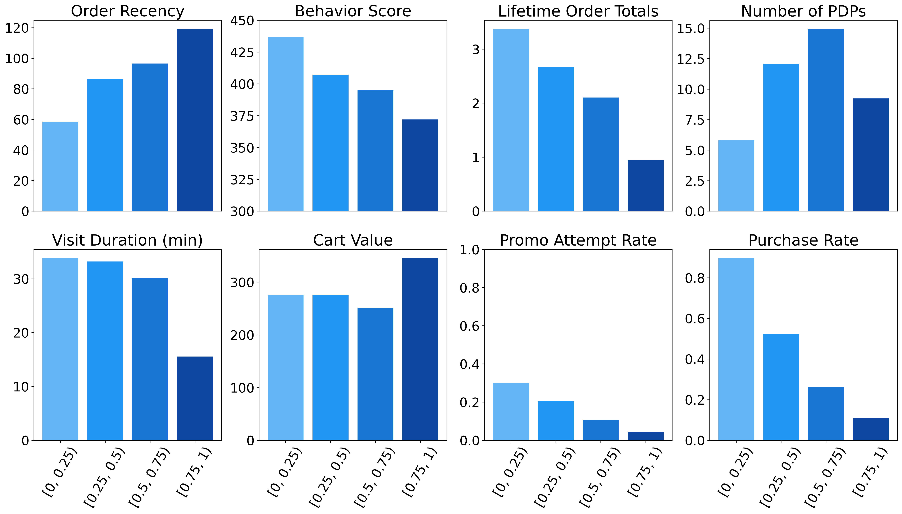

# Impact of Promotional Codes During Checkout on Fingerhut Customers

### TEAM Peppermint Mocha: [Karen Nguyen](https://github.com/knguyenx5)$^{1,2,&#8224}$;, [Alan Wang](https://github.com/alanwmy)$^{1,2,&#8224}$, [Anand Gowda](https://github.com/acgowda)$^{1,2,&#8224}$, [Deana Moghaddas](https://github.com/deanamgds19)$^{1,2,&#8224}$
$^1$ Department of Mathematics, UCLA, Los Angeles, CA 90095, USA. \
$^2$ Department of Statistics, UCLA, Los Angeles, CA 90095, USA. \
$^&#8224$ These authors contributed equally to this work.

### [Report](https://github.com/alanwmy00/M148_Project/blob/main/M148-Final-Report.pdf), [Presentation](https://github.com/alanwmy00/M148_Project/blob/main/M148-Presentation.pdf)

## Executive Summary
Fingerhut is looking to incentivize consumers to make a purchase, but in a strategic manner to effectively maximize revenue. To address this problem, one of the questions Bluestem Brands raises is how they can go about predicting a user’s behavior and activity to help inform whether it is worth it to incur marketing spend on this particular user. They want to uncover which users are more likely to convert based on their website activity and accessible features; these customers would be the population to target for marketing tactics since the tactics have a higher probability of succeeding.

For our case, our group narrows the problem raised by Bluestem Brands by investigating the effect of deploying promotional codes during checkout on conversion and purchase rates, since we have clear data on the usage of this marketing technique. We can see the picture above that promotional code failure leads to lower purchase rates compared to applying a successful code, so we want to explore the impact of applying promotional codes on purchase probabilities. We analyze individual user and session behavior and characteristics by looking at features such as their lifetime order totals, behavior score, visit duration, event list, etc. Using this information, we examine the probability that an individual customer would make a purchase with and without a promotional code in each visit session; the difference in these two probabilities is the metric we are interested in. We want to investigate whether there will be an increase in the probability of purchasing when offered a promotional code and if there is, how substantial the increase is. We hope that this will benefit Bluestem Brands by informing them which types of users they should ultimately target with promotional codes to best improve purchase rate and in turn, increase revenue.

To investigate our problem, we first select a variety of features that we thought would best represent and distinguish types of customers; these include a number of categorical and numeric features that we found to be statistically significant from preliminary testing. Following this, we build an Artificial Neural Network in conjunction with a Recurrent Neural Network and input our selected features into this model to train it to predict the probability of purchasing for each visit session. Our model reaches a good performance shown below:

With our model, we simulate the impact of promotional codes by predicting purchase probabilities with and without code usage. We examine the gain in probability for each individual visit session and group visits into four bins based on their gain in percentages: 0-25\%, 25-50\%, 50-75\%, and 75-100\%. Lastly, we summarize the features of visits in each bin and analyze what types of users are distinctly represented to make conclusions on which users Bluestem Brands should mainly target promotional codes to. 

In the end, our model signifies that Bluestem Brands should look to target promotional codes at new users, indicated by features such as low lifetime order totals, high order recencies, etc., in order to maximize the probability of conversion. Conversely, Bluestem Brands should stray away from offering promotional codes to returning users with high behavior scores, high lifetime order totals, etc., because promotional codes have the least significant effect on these users.

Our analysis aims to dive deeper into one of the various marketing tactics of Bluestem Brands and discover how the company should optimally employ it. This report contains a summary of our group’s methodologies and procedures, the results and findings, as well as plans for future work and development.
